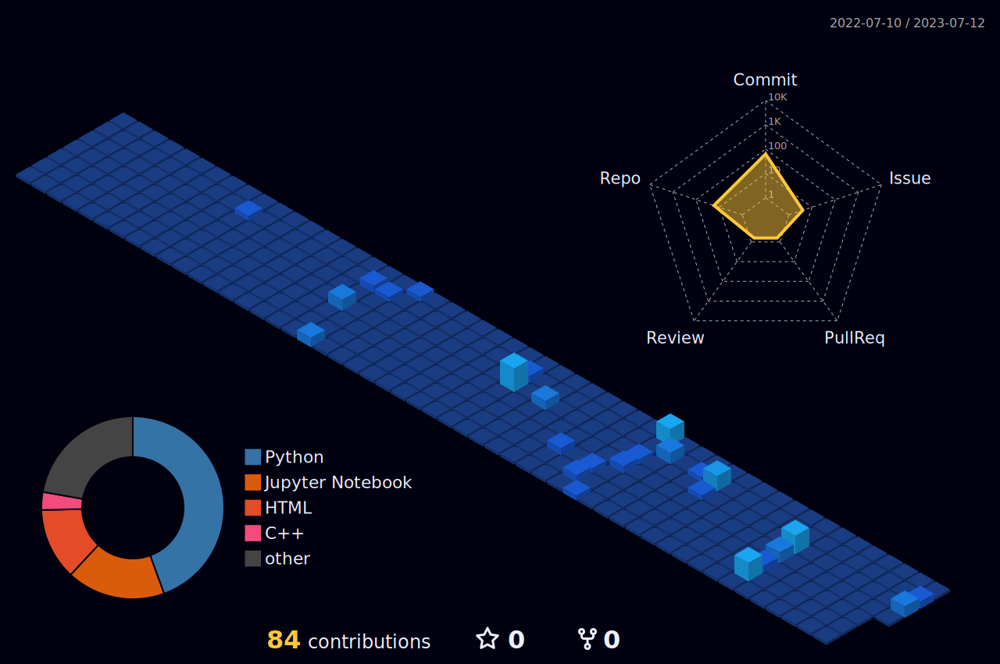

<h1>
  Hey there!
</h1>

  

  

  

About Me :man_technologist::

- :man_student:Currently a Grad Student at the University of Maryland, College Park.
- :robot: Exploring the world of Robotics.
- :computer: Learning ROS and Machine Learning.

My Stats
<!--  -->

